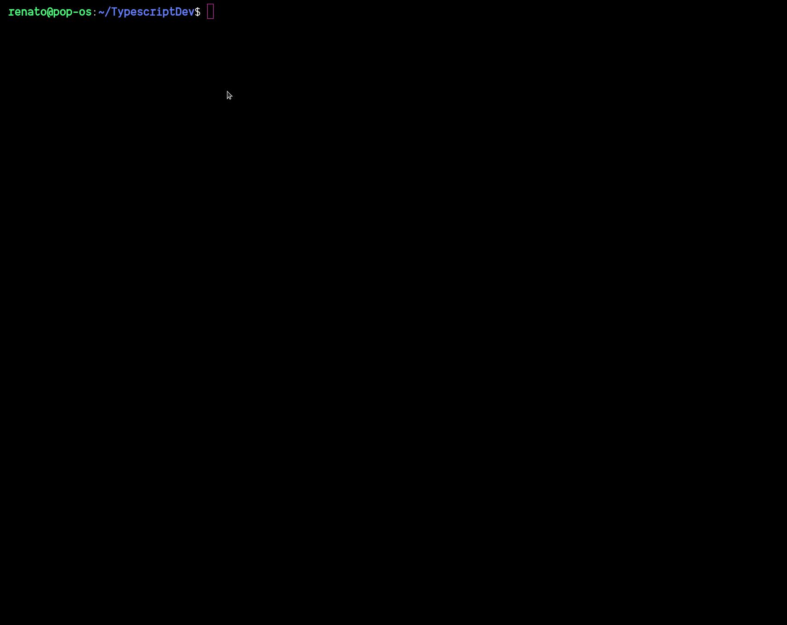
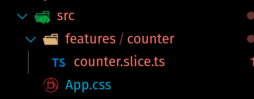
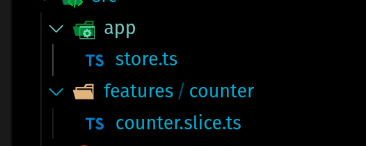
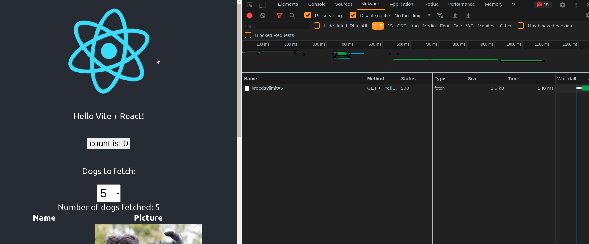

# Use the recommended React Redux patters and reduce boilerplate code

## Credits

This is my code along with episode of "Learn something new in 90 minutes" with JASON LENGSTORF [Let’s Learn Modern Redux!](https://www.learnwithjason.dev/let-s-learn-modern-redux) where [Redux](https://redux.js.org/) maintainer [MARK ERIKSON](https://twitter.com/acemarke) shows how radically reduce Redux boilerplate using the latest Redux API's.  What I tried to do is explain step by step the code demo shown on the episode.

## Scafold a React App

We'll use [vite](https://vitejs.dev/) to create a bare bones React app.

```bash
npm init @vitejs/app
```



## Install Redux dependencies:

```bash
npm i @reduxjs/toolkit@latest react-redux
```

## Create `features` folder under `src` and then create `counter` under `features` and then the file: `counter.slice.ts` inside

```bash
mkdir -p src/features/counter && touch src/features/counter/counter.slice.ts
```



### in `counter.slice.ts` define:

import from `@reduxjs/toolkit`

```typescript
import { createSlice, PayloadAction } from "@reduxjs/toolkit";
```

type this section of state as:

```typescript
interface CounterState {
  value: number;
}
```

define the initialState:

```typescript
const initialState: CounterState = {
  value: 0,
};
```

create the _counter_ slice: [Using createSlice](https://redux.js.org/tutorials/fundamentals/part-8-modern-redux#using-createslice)

```typescript
const counterSlide = createSlice({
  name: "counter",
  initialState,
  reducers: {
    incremented(state) {
      state.value++;
    },
    amountAdded(state, action: PayloadAction<number>) {
      state.value += action.payload;
    },
  },
});
```

where:

- **name**: a string that will be used as the prefix for generated action types
- **initialState**: The initial state of the reducer
- **reducers** an object where the keys are strings, and the values are "case reducer" functions that will handle  
  specific actions.

*

### **createSlice will create automatically the action creators** that correspond to each one of the `reducers` object

```typescript
export const { incremented, amountAdded } = counterSlide.actions;
```

### Will export default the `counter reducer` to use it in App Store

```typescript
export default counterSlide.reducer;
```

### One thing to note is that **createSlice** allows us to safely **mutate** the state!

## Create `app` folder under `src` and then create file: `store.ts`

```bash
mkdir src/app && touch src/app/store.ts
```



### inside `app/store.ts` define:

import from `@reduxjs/toolkit`

```typescript
import { configureStore } from "@reduxjs/toolkit";
```

And import the `counterReducer` from `conter.slice.ts`

```typescript
import counterReducer from "../features/counter/counter.slice";
```

Configure the store using the [configureStore](https://redux.js.org/tutorials/fundamentals/part-8-modern-redux#using-configurestore)

```typescript
export const store = configureStore({
  reducer: { counter: counterReducer },
});
```

Export two very important types `AppDispatch` type for all action creators and `RootState` the type for the entire store state

```typescript
export type AppDispatch = typeof store.dispatch;

export type RootState = ReturnType<typeof store.getState>;
```

### create file: `src/app/hooks.ts`

Create Hooks for `AppDispatch` and `AppSelector` (use specific slice of global state)

```typescript
import { TypedUseSelectorHook, useDispatch, useSelector } from "react-redux";
import { RootState, AppDispatch } from "./store";

export const useAppDispatch = () => useDispatch<AppDispatch>();
export const useAppSelector: TypedUseSelectorHook<RootState> = useSelector;
```

## configure Provider at `main.tsx`

```typescript
import { Provider } from "react-redux";
import { store } from "./app/store";
```

Configure `Provider`

```typescript
ReactDOM.render(
  <React.StrictMode>
    <Provider store={store}>
      <App />
    </Provider>
  </React.StrictMode>,
  document.getElementById("root")
);
```

## Now use Hooks on `App.tsx`

Import dependencies

```typescript
import { useAppDispatch, useAppSelector } from "./app/hooks";
import { incremented } from "./features/counter/counter.slice";
```

Fortunatelly the **App.tsx** demo code use a counter, we'll take advantage of that!

**comment** `useState` for `[count, setCount]`

```typescript
function App() {
  // const [count, setCount] = useState(0);
  return (
    <div className="App">
```

Add our React Redux Hooks

```typescript
const count = useAppSelector((state) => state.counter.value);
const dispatch = useAppDispatch();
```

Around line 21 change this:

```typescript
<button type="button" onClick={() => setCount((count) => count + 1)}>
```

For this:

```typescript
<button type="button" onClick={() => dispatch(incremented())}>
```

Run App in Dev: Click on count button

```bash
npm run dev
```


## But what about Async code (side effects)

Redux Store knows nothing about async logic!  
So when need _async logic_ interact with store you need **Redux middleware**
There are many kinds of async middleware for Redux. The most common by far is [redux-thunk](https://github.com/reduxjs/redux-thunk). this lets you write plain functions that may contain _async logic_ directly.

Redux Toolkit's `configureStore` function automatically sets up the thunk middleware by default and Redux team recommend using `Thunks` as the way to go for async logic with Redux.

### Exiting news! **RTK Query data fetching API**

Redux Toolkit has a new RTK Query data fetching API. RTK Query is a purpose built data fetching and caching solution for Redux apps, and **can eliminate the need to write any thunks or reducers to manage data fetching**. We encourage you to try it out and see if it can help simplify the data fetching code in your own apps!

## Demo time

We'll use this new RTK Query to fetch data.

create this new `apiSlice` at `src/features/dogs/dogs.api.slice.ts` file

Note: we'll use [The Dog API; Dogs as a Service](https://thedogapi.com/), you'll need an api key from them, get a free one. that will be stored in `.env.local` as `VITE_DOGS_API_KEY`

### First we'll create an API Slice

Imports:

```typescript
import { createApi, fetchBaseQuery } from "@reduxjs/toolkit/query/react";
```

We'll type the api response as:

```typescript
interface Breed {
  id: string;
  name: string;
  image: {
    url: string;
  };
}
```

define an _API slice_ that lists the server's base URL and which endpoints we want to interact
with.

```typescript
export const apiSlice = createApi({
  reducerPath: "api",
  baseQuery: fetchBaseQuery({
    baseUrl: "https://api.thedogapi.com/v1",
    prepareHeaders: (headers) => {
      if (typeof DOGS_API_KEY === "string") {
        headers.set("x-api-key", DOGS_API_KEY);
      }
      return headers;
    },
  }),
  endpoints: (builder) => ({
    fetchBreeds: builder.query<Breed[], number | void>({
      query: (limit = 10) => `/breeds?limit=${limit}`,
    }),
  }),
});
```

Export **Hooks** that are aut-generated based on the defined endpoints

```typescript
export const { useFetchBreedsQuery } = apiSlice;
```

### Configure Store

The "API Slice" contains the auto-generated Redux slice reducer and a custom middleware that manages suscription lifetimes. Both of those need to be added to the _Redux store_

```typescript
// at src/app/store.ts
import { apiSlice } from "../features/dogs/dogs.api.slice";
...
export const store = configureStore({
  reducer: { counter: counterReducer, [apiSlice.reducerPath]: apiSlice.reducer },
  middleware: (getDefaultMiddleware) => getDefaultMiddleware().concat(apiSlice.middleware),
});
```

## Use Hooks in App Component

Import our **useFetchBreedsQuery** from `dogs.api.slice.ts` file

```typescript
import { useFetchBreedsQuery } from "./features/dogs/dogs.api.slice";
```

That Hooks takes "optionally" (default=10) a number of dogs to fetch so:
Render the fetched data as **table**

```typescript
  const { data = [], error, isLoading } = useFetchBreedsQuery();
  // inside return create
    <div>Number of dogs fetched: {data.length}</div>
    <table>
      <thead>
        <tr>
          <th>Name</th>
          <th>Picture</th>
        </tr>
      </thead>
      <tbody>
        {data.map((breed) => (
          <tr key={breed.id}>
            <td>{breed.name}</td>
            <td>
              
            </td>
          </tr>
        ))}
      </tbody>
    </table>
```

et voilà


### Finally make it a bit more **dynamic**

Select the number of dogs to fetch!

```typescript
const [numDogs, setNumDogs] = useState(10);
const { data = [], error, isLoading } = useFetchBreedsQuery(numDogs);

// render a seelect to choose:
<div>
  <p>Dogs to fetch:</p>
  <select
    style={{ padding: "6px", font: "500 1.4em Arial" }}
    value={numDogs}
    onChange={(e) => setNumDogs(+e.target.value)}
  >
    <option value="5">5</option>
    <option value="10">10</option>
    <option value="15">15</option>
  </select>
</div>;
```

Now you can select to fetch 5,10,15 dogs.
**A very cool thing** is if you go to dev tools "network" and fetch 10, then back to 5
RTK Query will not fetch those, instead will use the cache data 💪


